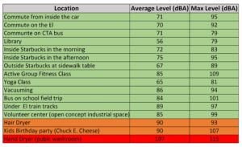
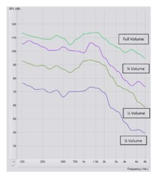

<!--StartFragment-->

Silence by definition is the absence of sound, stillness, or a period of time without speech or noise. Silence seems like it would be simple to attain, but in truth, it can be allusive. Imagine the last time you were in complete silence. Can you even think of the last time? Even when I am home alone there is still sound around me from the El train, cars driving by, or the hum of random household appliances.

There is no denying that we live in a noisy world that is only getting louder. Just think about your daily commute. If you drive you are exposed to the sounds from the radio and other passengers in your car as well as the sounds of the city going on outside: horns honking, sirens blaring, construction equipment hammering the pavement, and the drumming of street musicians on their buckets. I am one of these drivers and consider myself lucky as I have some control over the noise inside my car whereas those using public transportation many times rely on their earbuds to block out the noise. It also seems to me that more and more commuters are wearing earbuds. Which got me wondering…how much noise are we exposing ourselves to? Could it be enough to damage our hearing?

Having the ability to stream music, movies, and television shows wirelessly, from anywhere, at any given time is convenient but may also be damaging to our hearing. Why? Think of streaming through earbuds like a large bowl of Halloween candy. The bowl is filled with an assortment of delicious treats in a variety of sizes. It can be tempting to try them all, but you know eating all that candy in one sitting will have destructive effects on your waist line. Whereas, eating the candy in moderation over time is perfectly safe. The same is true for hearing. Think of the bowl with the various candy as your streaming options: music, movies, television, and the sizes of the candy as the volume you are streaming at. Full size candy bars would represent loud sounds while smaller bite size pieces would represent a softer volume. If you listen to a lot of loud music, TV shows, etc. in the same day you risk damaging your hearing, just as eating too much candy can damage your health.

We know that hearing loss is a cumulative process from noise exposure over time. But monitoring our intake of noise is harder than monitoring our candy intake. Be that as it may, it is still possible. Armed with a sound level meter app from the National Institute for Occupational Safety and Health (NIOSH) I ventured out to see how much noise I was being subjected to. Then I referenced the guidelines set by NIOSH to determine what environments had safe levels of sound and which had potentially damaging levels. The chart below shows my findings.

You may be wondering what do all these measurements mean? NIOSH states that levels below 85dBA for a length of 8 hours is safe. But for levels just 3dB louder the sound becomes damaging and the time spent in these environments should be cut in half. Meaning if you’re in an environment with 88dBA you should limited your time there to 4 hours or less, and environments with 91dBA should be limited to 2 hours or less and so on. Using these standards all the recordings highlighted in green would be considered safe.

However, the length of time spent in the orange and red environments needs to be limited to avoid damaging your hearing. Orange levels, like the birthday party, can still be safe in controlled amounts of time. Since we were only there for 2 hours it is considered a safe amount of exposure. An employee working an 8-hour shift is still within a safe range, but would have hit their daily limit for allowable noise exposure. Meaning if this employee is in levels of noise above 85dBA after leaving work they will have exceeded their allowable noise for the day and be at risk of damaging their hearing.

The red environments are those that can quickly damage hearing. The hand dryer with an average level of 107dBA could damage your hearing in just minutes. Fortunately, that was the only environment I encountered with potentially damaging levels of noise, but other commonly known environments in this red zone would be concerts or front row seats near a fireworks display. Using ear protection in these environments is highly recommended.

Knowing how much noise we’re exposed to in various environments is a good start. Finding out how much extra noise were exposed to using earbuds is a little harder. I found a shocking study completed by Researchers at the University of Maryland. They found that there were 116 reported deaths or injuries of pedestrians wearing headphones between January 2004 and June 2011. This may not seem too shocking until you find out that over half of those pedestrians were hit by trains that were blowing their horns. Blowing their horns! Can you imagine not hearing or being too distracted to hear a train horn because of the sounds coming from your earbuds?

For both of these reasons wearing earbuds is prohibited in work environments where ear protection is required. The Occupations Safety and Health Administration (OSHA) published a letter on the use of Walkman radios and CD players in the workplace. I know Walkman’s are not in use anymore, but this was published in 1987 and is still relevant so bear with me. OSHA found in a North Carolina textile mill the average Walkman was being used at 84dBA but 20% of the employees were listening at 90dBA or louder. The industrial hygiene department at GM found the typical headset level of auto workers was 99 to 100dBA with a max level of 117dBA. They did not state in this document why there was such a difference between facilities, but my guess would be that it was related to the level of noise in each environment. Louder environmental sounds would result in louder Walkman levels to hear the music over the noise.

I only wear my earbuds when going out for a run, and I have a custom-made set which reduces some of the environmental noise. Still I am guilty of occasionally turning up the volume when I am in really loud environments. So, at what point would those of us wearing earbuds be damaging our hearing? A generally excepted rule of thumb is to set the volume at a third to just under half the allowable range for the volume to be at a safe level. I decided to test this out. Using my Real-Ear equipment I measured the level of my earbuds at ¼ volume, ½ volume, ¾ volume, and at full volume. The chart on the left shows the output at each volume setting. My measurements indicate that wearing earbuds at levels just under the ½ way mark or lower are safe, but listening at higher levels was enough to damage my hearing.

If you are interested in calculating your daily exposure, download a sound level meter on your smartphone. Record the level of sound you are exposed to in various environments throughout your day, then go to [noisemeters.com](https://noisemeters.com/apps/occ/twa-dose.asp.). From here you can enter the level of sound you were exposed to as well as the length of time you were in each environment. The site will then calculate your exposure or dose percentage for that time period.

Finally, if you use earbuds on a regular basis I highly recommend investing in custom-made earbuds. Custom-made earbuds are more comfortable, have better retention, and most importantly reduce some of the environmental sounds. Reducing the environmental sound allows you to hear the richness of the sound your streaming without having to increase the volume to dangerous levels. Best of all these are available from Boutique Hearing. Call me to discuss how we can improve your listening experience.

<!--EndFragment-->